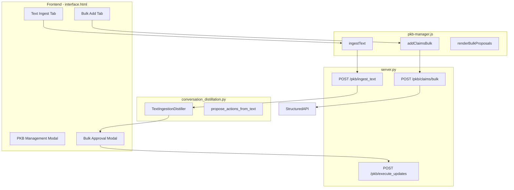

# Bulk Memory Operations for PKB

## Goals

1. **Bulk Row-wise Add Modal**: Add multiple memories manually via a row-wise interface
2. **Bulk Text Paste + AI Analysis**: Paste large text, let LLM parse and compare with existing memories, propose additions/edits/removals
3. **Enhanced Bulk Approval Modal**: Unified modal for approving multiple memory actions (reusable for conversation flow and text ingest)

---

## Architecture Overview



---

## Phase 1: Backend - Bulk Add Claims Endpoint

### File: [server.py](server.py)

Add new endpoint for bulk claim addition:

```python
@app.route('/pkb/claims/bulk', methods=['POST'])
@login_required
def pkb_add_claims_bulk():
    """
    POST API endpoint to add multiple claims at once.
    
    Expects JSON:
        claims: Array of claim objects, each with:
                                                - statement (required)
                                                - claim_type (default: 'fact')
                                                - context_domain (default: 'personal')
                                                - tags (optional): Array of tag names
                                                - auto_extract (default: false)
    
    Returns:
        JSON with:
                                                - success: boolean
                                                - results: Array of {index, success, claim_id, error}
                                                - added_count: number of successfully added claims
    """
```


### File: [truth_management_system/interface/structured_api.py](truth_management_system/interface/structured_api.py)

Add bulk add method to StructuredAPI:

```python
def add_claims_bulk(
    self, 
    claims: List[Dict], 
    auto_extract: bool = False,
    stop_on_error: bool = False
) -> ActionResult:
    """
    Add multiple claims in a single operation.
    
    Args:
        claims: List of dicts with statement, claim_type, context_domain, tags
        auto_extract: If True, extract entities/tags for each claim
        stop_on_error: If True, stop at first failure; else continue
        
    Returns:
        ActionResult with data containing results list and counts
    """
```

---

## Phase 2: Backend - Text Ingestion with AI Analysis

### File: [truth_management_system/interface/text_ingestion.py](truth_management_system/interface/text_ingestion.py) (NEW FILE)

Create new module for text-based bulk ingestion with LLM analysis:

```python
@dataclass
class IngestCandidate:
    """A candidate claim extracted from text ingestion."""
    statement: str
    claim_type: str
    context_domain: str
    confidence: float
    line_number: Optional[int] = None  # Original line in input
    original_text: Optional[str] = None  # Original fragment

@dataclass  
class IngestProposal:
    """Proposed action for a candidate."""
    action: str  # 'add', 'edit', 'skip', 'remove'
    candidate: IngestCandidate
    existing_claim: Optional[Claim] = None
    similarity_score: Optional[float] = None
    reason: str = ""
    editable: bool = True  # User can edit statement before saving

@dataclass
class TextIngestionPlan:
    """Complete plan for text ingestion."""
    raw_text: str
    candidates: List[IngestCandidate]
    proposals: List[IngestProposal]
    summary: str = ""
    total_lines_parsed: int = 0
    
class TextIngestionDistiller:
    """
    Parses bulk text into claims, analyzes against existing memory,
    and proposes comprehensive actions.
    """
    
    def __init__(self, api: StructuredAPI, keys: Dict[str, str], config: PKBConfig = None):
        ...
    
    def ingest_and_propose(
        self, 
        text: str,
        default_claim_type: str = 'fact',
        default_domain: str = 'personal',
        use_llm_parsing: bool = True  # Use LLM for intelligent parsing vs simple line-split
    ) -> TextIngestionPlan:
        """
        Main entry point. Parses text, finds matches, proposes actions.
        
        Process:
                                1. Parse text into candidate claims (LLM or rule-based)
                                2. For each candidate:
           a. Search existing claims for similar/duplicate
           b. Determine action: add (new), edit (update existing), skip (duplicate)
                                3. Return plan for user approval
        """
        
    def _parse_text_with_llm(self, text: str, default_type: str, default_domain: str) -> List[IngestCandidate]:
        """Use LLM to intelligently parse freeform text into structured claims."""
        
    def _parse_text_simple(self, text: str, default_type: str, default_domain: str) -> List[IngestCandidate]:
        """Rule-based parsing (similar to migrate_user_details.py)."""
        
    def _find_matches_for_candidate(self, candidate: IngestCandidate) -> List[Tuple[Claim, float]]:
        """Search for existing claims that match/conflict with candidate."""
        
    def _determine_action(
        self, 
        candidate: IngestCandidate, 
        matches: List[Tuple[Claim, float]]
    ) -> IngestProposal:
        """
        Determine what action to take:
                                - score > 0.95: skip (exact duplicate)
                                - score > 0.8: edit (update existing claim)
                                - score > 0.6: add with warning (related exists)
                                - score < 0.6: add (new)
        """
```


### File: [server.py](server.py)

Add text ingestion endpoint:

```python
@app.route('/pkb/ingest_text', methods=['POST'])
@login_required
def pkb_ingest_text():
    """
    POST API endpoint to parse and analyze bulk text for memory ingestion.
    
    Expects JSON:
        text (required): Raw text to parse
        default_claim_type: Default type for extracted claims (default: 'fact')
        default_domain: Default domain (default: 'personal')
        use_llm: Use LLM for intelligent parsing (default: true)
    
    Returns:
        JSON with:
                                                - plan_id: UUID to reference this plan
                                                - proposals: Array of proposed actions
                                                - summary: Human-readable summary
                                                - total_parsed: Number of items extracted
    """
```

---

## Phase 3: Frontend - Bulk Add Tab in PKB Modal

### File: [interface/interface.html](interface/interface.html)

Add new tab "Bulk Add" to the existing PKB modal tabs. Location: inside `#pkb-modal .modal-body`, after the existing tabs content.**New Tab Button:**

```html
<li class="nav-item">
  <a class="nav-link" id="pkb-tab-bulk" data-toggle="tab" href="#pkb-bulk-pane">
    <i class="bi bi-plus-square"></i> Bulk Add
  </a>
</li>
```

**New Tab Content (pkb-bulk-pane):**

- Container div for bulk rows
- Each row: statement textarea, type dropdown, domain dropdown, tags input, remove button
- "Add Another Row" button
- "Save All Memories" button
- Progress indicator during save
```html
<div class="tab-pane fade" id="pkb-bulk-pane">
  <div class="mb-3">
    <small class="text-muted">Add multiple memories at once. Each row becomes one memory item.</small>
  </div>
  
  <div id="pkb-bulk-rows-container">
    <!-- Rows will be rendered here by JS -->
  </div>
  
  <div class="mt-3 d-flex justify-content-between">
    <button class="btn btn-outline-primary" id="pkb-bulk-add-row">
      <i class="bi bi-plus"></i> Add Another Row
    </button>
    <button class="btn btn-success" id="pkb-bulk-save-all">
      <i class="bi bi-check-all"></i> Save All Memories
    </button>
  </div>
  
  <div id="pkb-bulk-progress" class="mt-3" style="display:none;">
    <div class="progress">
      <div class="progress-bar" role="progressbar" style="width: 0%"></div>
    </div>
    <small class="text-muted"><span id="pkb-bulk-progress-text"></span></small>
  </div>
</div>
```


---

## Phase 4: Frontend - Text Ingest Tab in PKB Modal

### File: [interface/interface.html](interface/interface.html)

Add new tab "Import Text" for bulk text paste functionality.**New Tab Button:**

```html
<li class="nav-item">
  <a class="nav-link" id="pkb-tab-import" data-toggle="tab" href="#pkb-import-pane">
    <i class="bi bi-file-text"></i> Import Text
  </a>
</li>
```

**New Tab Content (pkb-import-pane):**

```html
<div class="tab-pane fade" id="pkb-import-pane">
  <div class="mb-3">
    <small class="text-muted">
      Paste a large block of text below. The AI will extract memories, 
      compare with existing ones, and let you review before saving.
    </small>
  </div>
  
  <div class="form-group">
    <textarea id="pkb-import-text" class="form-control" rows="10" 
              placeholder="Paste your text here...&#10;- I prefer working in the morning&#10;- My favorite color is blue&#10;- I'm allergic to peanuts"></textarea>
  </div>
  
  <div class="row mb-3">
    <div class="col-md-6">
      <label for="pkb-import-default-type">Default Type</label>
      <select id="pkb-import-default-type" class="form-control">
        <option value="fact" selected>Fact</option>
        <option value="preference">Preference</option>
        <option value="memory">Memory</option>
        <!-- other options -->
      </select>
    </div>
    <div class="col-md-6">
      <label for="pkb-import-default-domain">Default Domain</label>
      <select id="pkb-import-default-domain" class="form-control">
        <option value="personal" selected>Personal</option>
        <!-- other options -->
      </select>
    </div>
  </div>
  
  <div class="form-check mb-3">
    <input type="checkbox" class="form-check-input" id="pkb-import-use-llm" checked>
    <label class="form-check-label" for="pkb-import-use-llm">
      Use AI for intelligent parsing (recommended)
    </label>
  </div>
  
  <button class="btn btn-primary" id="pkb-import-analyze">
    <i class="bi bi-magic"></i> Analyze &amp; Extract Memories
  </button>
  
  <div id="pkb-import-loading" class="mt-3" style="display:none;">
    <div class="spinner-border text-primary" role="status"></div>
    <span class="ml-2">Analyzing text...</span>
  </div>
</div>
```

---

## Phase 5: Frontend - Enhanced Bulk Approval Modal

### File: [interface/interface.html](interface/interface.html)

Enhance the existing `memory-proposal-modal` to support:

- Edit capability per proposal
- Different action types with visual distinction (add/edit/skip/remove)
- Select all / Deselect all buttons
- Counts summary

Replace or enhance the existing modal:

```html
<div class="modal fade" id="memory-proposal-modal" tabindex="-1" data-backdrop="static" style="z-index: 1075;">
  <div class="modal-dialog modal-lg">
    <div class="modal-content">
      <div class="modal-header bg-info text-white">
        <h5 class="modal-title"><i class="bi bi-lightbulb"></i> Review Memory Updates</h5>
        <button type="button" class="close text-white" data-dismiss="modal">&times;</button>
      </div>
      <div class="modal-body">
        <p id="memory-proposal-intro" class="text-muted mb-3"></p>
        
        <!-- Summary counts -->
        <div class="mb-3 d-flex gap-2">
          <span class="badge badge-success" id="proposal-add-count">0 new</span>
          <span class="badge badge-warning" id="proposal-edit-count">0 updates</span>
          <span class="badge badge-secondary" id="proposal-skip-count">0 skipped</span>
        </div>
        
        <!-- Select controls -->
        <div class="mb-2">
          <button class="btn btn-sm btn-outline-secondary" id="proposal-select-all">Select All</button>
          <button class="btn btn-sm btn-outline-secondary" id="proposal-deselect-all">Deselect All</button>
        </div>
        
        <div id="memory-proposal-list" style="max-height: 400px; overflow-y: auto;">
          <!-- Proposals rendered as editable rows -->
        </div>
        
        <input type="hidden" id="memory-proposal-plan-id">
      </div>
      <div class="modal-footer">
        <button class="btn btn-outline-secondary" data-dismiss="modal">
          <i class="bi bi-x-lg"></i> Cancel
        </button>
        <button class="btn btn-primary" id="memory-proposal-save">
          <i class="bi bi-check-lg"></i> Save Selected (<span id="proposal-selected-count">0</span>)
        </button>
      </div>
    </div>
  </div>
</div>
```

---

## Phase 6: Frontend - JavaScript Functions

### File: [interface/pkb-manager.js](interface/pkb-manager.js)

Add new functions to PKBManager module:

```javascript
// =========================================================================
// BULK ADD FUNCTIONS
// =========================================================================

/**
    * Add a new row to the bulk add interface.
 */
function addBulkRow() {
    var rowIndex = $('.pkb-bulk-row').length;
    var rowHtml = renderBulkRow(rowIndex);
    $('#pkb-bulk-rows-container').append(rowHtml);
}

/**
    * Render a single bulk add row.
 */
function renderBulkRow(index) {
    return `<div class="pkb-bulk-row card mb-2" data-index="${index}">...</div>`;
}

/**
    * Remove a bulk add row.
 */
function removeBulkRow(index) {
    $(`.pkb-bulk-row[data-index="${index}"]`).remove();
}

/**
    * Collect all bulk rows and send to server.
 */
function saveBulkClaims() {
    var claims = [];
    // Collect from each row
    // POST to /pkb/claims/bulk
    // Show progress, handle results
}

// =========================================================================
// TEXT INGEST FUNCTIONS
// =========================================================================

/**
    * Send text to backend for AI analysis.
 */
function analyzeTextForIngestion() {
    var text = $('#pkb-import-text').val().trim();
    var defaultType = $('#pkb-import-default-type').val();
    var defaultDomain = $('#pkb-import-default-domain').val();
    var useLlm = $('#pkb-import-use-llm').is(':checked');
    
    return $.ajax({
        url: '/pkb/ingest_text',
        method: 'POST',
        contentType: 'application/json',
        data: JSON.stringify({
            text: text,
            default_claim_type: defaultType,
            default_domain: defaultDomain,
            use_llm: useLlm
        })
    });
}

// =========================================================================
// ENHANCED BULK APPROVAL MODAL
// =========================================================================

/**
    * Render proposals in bulk approval modal with edit capability.
    * @param {Array} proposals - Array of proposal objects
    * @param {string} source - 'conversation' | 'text_ingest'
 */
function renderBulkProposals(proposals, source) {
    // Render each proposal as an editable row
    // Include checkbox, action badge, editable statement, type/domain dropdowns
    // Update counts
}

/**
    * Render a single proposal row with edit capability.
 */
function renderProposalRow(proposal, index) {
    // Row with:
    // - Checkbox (checked by default for add/edit, unchecked for skip)
    // - Action badge (Add/Update/Skip)
    // - Editable statement textarea
    // - Type and domain dropdowns (collapsed by default)
    // - If edit: show existing claim it will update
}

/**
    * Collect approved proposals with any edits.
 */
function collectApprovedProposals() {
    var approved = [];
    $('.proposal-row').each(function() {
        if ($(this).find('.proposal-checkbox').is(':checked')) {
            approved.push({
                index: $(this).data('index'),
                statement: $(this).find('.proposal-statement').val(),
                claim_type: $(this).find('.proposal-type').val(),
                context_domain: $(this).find('.proposal-domain').val()
            });
        }
    });
    return approved;
}
```

---

## Phase 7: Backend - Execute Enhanced Updates

### File: [server.py](server.py)

Modify `/pkb/execute_updates` to support edited proposals:

```python
@app.route('/pkb/execute_updates', methods=['POST'])
def pkb_execute_updates():
    """
    Enhanced endpoint supporting:
                - approved_indices: List of indices to execute
                - edits: Optional dict mapping index to edited fields
    
    Expects JSON:
        plan_id: UUID of stored plan
        approved: Array of {index, statement?, claim_type?, context_domain?}
    """
```

---

## Task Summary

| Task ID | Description | Files ||---------|-------------|-------|| bulk-api-endpoint | Add /pkb/claims/bulk endpoint | server.py, structured_api.py || text-ingest-module | Create TextIngestionDistiller class | text_ingestion.py (new) || text-ingest-endpoint | Add /pkb/ingest_text endpoint | server.py || html-bulk-tab | Add Bulk Add tab to PKB modal | interface.html || html-import-tab | Add Import Text tab to PKB modal | interface.html || html-approval-modal | Enhance bulk approval modal | interface.html || js-bulk-add | Add bulk add JS functions | pkb-manager.js || js-text-ingest | Add text ingest JS functions | pkb-manager.js || js-approval-enhanced | Enhance approval modal rendering | pkb-manager.js || execute-with-edits | Update execute endpoint for edits | server.py || exports-update | Export new classes from package | **init**.py |---

## Potential Challenges and Mitigations

1. **LLM Rate Limits on Bulk Text**

- Mitigation: Batch candidates, use simple parsing as fallback

2. **Large Text Performance**

- Mitigation: Limit input size (e.g., 50KB), paginate proposals in modal

3. **Duplicate Detection Accuracy**

- Mitigation: Use hybrid search (FTS + embedding), show similarity scores to user

4. **UI Responsiveness During Bulk Save**

- Mitigation: Show progress bar, save in batches, allow cancellation