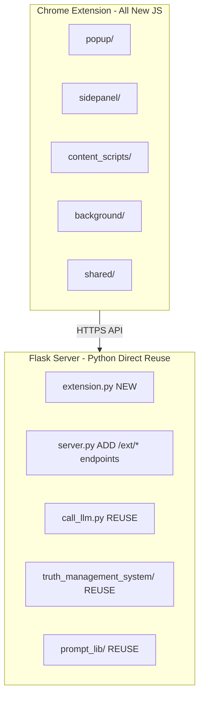

# Chrome Extension Implementation Plan

## Current State

- Design documents complete: [EXTENSION_DESIGN.md](extension/EXTENSION_DESIGN.md), [reuse_or_build.md](extension/reuse_or_build.md)
- Directory structure created but empty
- `manifest.json` defined
- No Python backend changes yet
- No JavaScript implementation yet

## Architecture Overview




## Build Order Rationale

**Backend First**: Extension cannot be tested without working APIs. Python code is directly reusable, so backend is faster to build.**Incremental Complexity**: Start with auth  (just username and password similar to how current `/login` workflow and interface/login.html works) and basic chat + page extraction, then personalization, then advanced features.---

## Milestone 1: Python Backend (Days 1-3)

### Task 1.1: Create `extension.py` Module

Create [extension.py](extension.py) with:

```python
# Core class structure
class ExtensionConversation:
    """Simplified conversation for extension (no workspaces)."""
    def __init__(self, conversation_id, user_email, ...): ...
    def add_message(self, role, content, page_context=None): ...
    def get_history(self, limit=10): ...
    def summarize_old_messages(self, count=10): ...

class ExtensionDB:
    """SQLite operations for extension tables."""
    def __init__(self, db_path): ...
    def create_tables(self): ...
    # CRUD for conversations, messages, scripts, settings

class ExtensionAuth:
    """Token-based authentication."""
    def generate_token(self, user_email): ...
    def verify_token(self, token): ...
    def require_ext_auth(func): ...  # Decorator
```

**Dependencies**: Import from existing `Conversation.py`, `call_llm.py`

### Task 1.2: Add Extension Database Tables

Add to [users/extension.db](users/extension.db):

```sql
-- ExtensionConversations, ExtensionMessages, 
-- ExtensionConversationMemories, CustomScripts, ExtensionSettings
-- (Schema defined in EXTENSION_DESIGN.md Section 10.3)
```


### Task 1.3: Add `/ext/*` Endpoints to `server.py`

Add to [server.py](server.py):| Endpoint | Priority | Depends On ||----------|----------|------------|| `POST /ext/auth/login` | P0 | ExtensionAuth || `POST /ext/auth/logout` | P0 | ExtensionAuth || `GET /ext/auth/verify` | P0 | ExtensionAuth || `GET /ext/conversations` | P0 | ExtensionDB || `POST /ext/conversations` | P0 | ExtensionDB || `GET /ext/conversations/<id>` | P0 | ExtensionDB || `DELETE /ext/conversations/<id>` | P0 | ExtensionDB || `POST /ext/chat/<id>` | P0 | ExtensionConversation, CallLLm || `POST /ext/chat/quick` | P1 | CallLLm |**Testing Checkpoint**: Use curl/Postman to verify all endpoints return expected responses---

## Milestone 2: Extension Core Scaffolding (Days 4-5)

### Task 2.1: Shared Utilities

Create [shared/constants.js](extension/shared/constants.js):

```javascript
export const API_BASE = 'http://localhost:5000';
export const MODELS = ['gpt-4', 'gpt-4-turbo', 'claude-3-opus', ...];
```

Create [shared/storage.js](extension/shared/storage.js):

```javascript
export async function getToken() { ... }
export async function setToken(token) { ... }
export async function getSettings() { ... }
```

Create [shared/api.js](extension/shared/api.js):

```javascript
export async function apiCall(endpoint, options) { ... }
export async function streamingApiCall(endpoint, options, onChunk) { ... }
export async function login(username, password) { ... }
export async function logout() { ... }
export async function getConversations() { ... }
export async function sendMessage(convId, message, options) { ... }
```


### Task 2.2: Background Service Worker

Create [background/service-worker.js](extension/background/service-worker.js):

```javascript
// Context menu setup
// Message passing handlers
// Multi-tab coordination
chrome.runtime.onInstalled.addListener(() => { ... });
chrome.contextMenus.create({ ... });
chrome.runtime.onMessage.addListener((msg, sender, respond) => { ... });
```


### Task 2.3: Basic Popup UI

Create [popup/popup.html](extension/popup/popup.html), [popup/popup.js](extension/popup/popup.js), [popup/popup.css](extension/popup/popup.css):

- Login form (if not authenticated)
- Quick actions (Summarize Page, Open Sidepanel)
- Recent conversations list
- Settings link

**Testing Checkpoint**: Extension loads in Chrome, popup shows login form---

## Milestone 3: Sidepanel Chat Interface (Days 6-9)

### Task 3.1: Sidepanel HTML Structure

Create [sidepanel/sidepanel.html](extension/sidepanel/sidepanel.html):

```javascript
Header: Logo, Settings button
Conversation List: Collapsible, [+] new, delete
Settings Row: Model dropdown, Prompt dropdown
Chat Area: Message cards (user/assistant)
Input Area: Textarea, Send button, Attach buttons
```


### Task 3.2: Sidepanel JavaScript

Create [sidepanel/sidepanel.js](extension/sidepanel/sidepanel.js):

```javascript
class SidepanelApp {
    constructor() { ... }
    async loadConversations() { ... }
    async selectConversation(id) { ... }
    async sendMessage() { ... }
    handleStreamingResponse(reader) { ... }
    renderMessage(role, content) { ... }
}
```

**Pattern Reference**: Study `interface/common-chat.js` for streaming logic

### Task 3.3: Sidepanel CSS

Create [sidepanel/sidepanel.css](extension/sidepanel/sidepanel.css):

- Full height layout
- Dark/light theme support
- Message card styling
- Code block styling with copy button
- Input area styling

### Task 3.4: Include Libraries

Add to [lib/](extension/lib/):

- `marked.min.js` (markdown rendering)
- `highlight.min.js` + theme CSS (code highlighting)

**Testing Checkpoint**: Can create conversation, send message, receive streaming response---

## Milestone 4: Page Content Extraction (Days 10-11)

### Task 4.1: Content Script - Extractor

Create [content_scripts/extractor.js](extension/content_scripts/extractor.js):

```javascript
function extractPageContent() {
    // Title, URL, meta description
    // Main content (use Readability-like algorithm)
    // Handle dynamic SPAs
}

function extractSelectedText() { ... }

function captureScreenshot() {
    // Use chrome.tabs.captureVisibleTab
}

chrome.runtime.onMessage.addListener((msg, sender, respond) => {
    if (msg.type === 'EXTRACT_PAGE') { ... }
    if (msg.type === 'GET_SELECTION') { ... }
});
```


### Task 4.2: Floating Toggle Button

Create [content_scripts/floating_button.js](extension/content_scripts/floating_button.js):

```javascript
function createFloatingButton() {
    // Position: bottom-right
    // Click: chrome.sidePanel.open()
}
```


### Task 4.3: Wire Page Content to Chat

Update sidepanel to:

- "Include Page" button → requests content from content script
- Display page URL/title indicator when attached
- Send page_content in chat request

**Testing Checkpoint**: Can include current page content in conversation---

## Milestone 5: Personalization Features (Days 12-14)

### Task 5.1: Model Selection

- Fetch available models from server
- Dropdown in sidepanel
- Persist selection per conversation

### Task 5.2: Prompt Selection

- Fetch prompts via `/get_prompts`
- Dropdown in sidepanel
- Preview prompt (tooltip)

### Task 5.3: Memory Selection

- Fetch memories via `/pkb/claims`
- Multi-select UI
- "Auto-suggest" via `/pkb/relevant_context`
- Attach to conversation

### Task 5.4: Settings Panel

- History length slider (1-50)
- Default model/prompt
- Auto-save toggle
- Theme selection

**Testing Checkpoint**: Can change model/prompt/memory, settings persist---

## Milestone 6: Context Menu & Quick Actions (Days 15-17)

### Task 6.1: Context Menu Registration

In service-worker.js:

```javascript
chrome.contextMenus.create({
    id: 'ai-explain',
    title: 'AI: Explain',
    contexts: ['selection']
});
// Similar for: Summarize, Translate, Critique, ELI5
```


### Task 6.2: Response Modal

Create [content_scripts/modal.js](extension/content_scripts/modal.js), [content_scripts/modal.css](extension/content_scripts/modal.css):

- Floating modal overlay on page
- Draggable/resizable
- Streaming response display
- Copy button
- "Continue in sidepanel" button

### Task 6.3: Quick Action Handler

- User selects text → right-clicks → "Explain"
- Background receives event → calls `/ext/chat/quick`
- Injects modal → streams response

**Testing Checkpoint**: Right-click "Explain" on selected text shows modal with response---

## Milestone 7: Voice Input & Polish (Days 18-20)

### Task 7.1: STT Integration

- Microphone button in input area
- Record audio → POST to `/transcribe`
- Insert transcribed text into input

### Task 7.2: Multi-Tab Support

- Tab selector modal
- Fetch content from multiple tabs
- Aggregate into message context

### Task 7.3: Error Handling & Polish

- Network error handling with retry
- Loading states
- Empty states
- Keyboard shortcuts (Cmd+Enter to send)
- Auto-scroll on new message