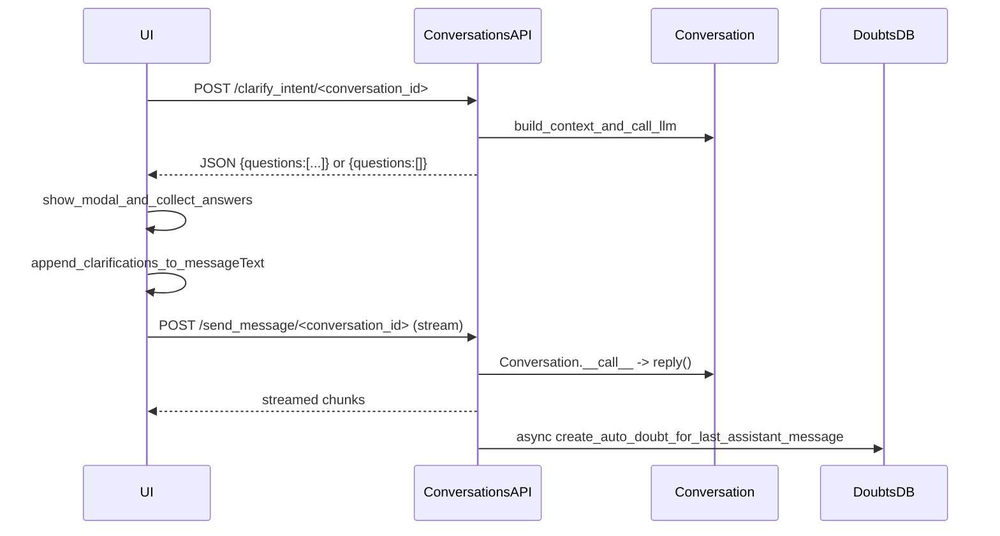

# Add pre-send clarifications + post-reply auto-doubt

## Requirements (what you asked)

- **Pre-send clarifications**: Before calling `POST /send_message/<conversation_id>` from the UI, allow a **manual** “Clarify” action that calls an LLM-backed API to produce **up to 3 multiple-choice questions** to clarify intent/objective. Show these in a modal, collect answers, then **append the clarifications to the outgoing user query** (so it appears in the user message card and is sent to the server).
- **Post-reply automatic doubt**: After `Conversation.reply()` finishes (i.e., after a turn completes), automatically generate a **short, crisp, on-topic takeaways/actionables/facts** version of the assistant answer. Persist it as a **root doubt** in the existing `DoubtsClearing` table for the assistant message, but **do not auto-open** the doubts modal.

## Repo survey (what exists today and what we will leverage)

- **Server streaming path**: `endpoints/conversations.py:/send_message/<conversation_id>` runs the `Conversation` generator in a background task and streams via a queue, calling `Conversation.__call__()` which yields newline-delimited JSON chunks.
- **Message IDs + persistence**: `Conversation.persist_current_turn(...)` creates `message_id`s and writes messages to storage when `persist_or_not` is enabled; auto-doubt must therefore attach only when persistence is on.
- **Doubts persistence**: `endpoints/doubts.py:/clear_doubt/<conversation_id>/<message_id>` persists doubts via `database.doubts.add_doubt(...)`. We will reuse this existing DB helper and avoid a DB schema migration initially.
- **UI send entrypoint**: `interface/chat.js` binds `#sendMessageButton` to `sendMessageCallback()` (in `interface/common-chat.js`), and `ChatManager.sendMessage(...)` renders the user card immediately then calls `fetch('/send_message/' + conversationId, ...)`.
- **Existing doubts UI**: `interface/doubt-manager.js` already fetches doubts via `GET /get_doubts/<conversation_id>/<message_id>` and shows them in a modal. Because you chose “persist but do not auto-open”, no new doubts UI is required.
- See CLARIFICATIONS_AND_AUTO_DOUBT_CONTEXT.md for more repo context.

## High-level design

### Data flow

### Why API-based clarifications (vs UI-side LLM)

- **Keeps keys/server-side policy centralized** (same as your other LLM operations like summaries and doubts).
- **Consistent auth/ratelimiting** via `login_required` + `Flask-Limiter`.
- UI stays thin: just renders a modal from a JSON schema.

## API and schema details

### 1) Clarifications endpoint

- **New route**: `POST /clarify_intent/<conversation_id>`
- **Location**: add to existing blueprint in [`endpoints/conversations.py`](/Users/ahemf/Documents/Backup_2025/Research/chatgpt-iterative/endpoints/conversations.py) (keeps auth + conversation permission checks consistent with `send_message`).
- **Request JSON**:
- `messageText: string` (required)
- `checkboxes: object` (optional)
- `links: string` (optional)
- `search: string` (optional)
- **Response JSON**:
- `needs_clarification: bool`
- `questions: Array<{ id: string, prompt: string, options: Array<{ id: string, label: string }> }>` (length 0–3)
- `recommended_append_template?: string` (optional; if omitted, UI uses a default append format)

#### Prompting strategy

- Use a cheap model (same family as your “summary/title” or “next question suggestions” flows).
- Output must be **strict JSON** with max 3 questions.
- If the user prompt is already specific, return `needs_clarification=false` and `questions=[]`.

#### Validation + failure behavior (concrete)

- If `messageText` is empty/whitespace: return `400` in the repo’s standard error JSON shape.
- If LLM fails or output cannot be parsed as strict JSON: return `{ needs_clarification: false, questions: [] }` so users are never blocked.
- Cap options per question to 2–5; cap total questions to 3.

### 2) Auto-doubt generation

- **When**: after a successful `/send_message` turn completes.
- **Where**: in [`endpoints/conversations.py`](/Users/ahemf/Documents/Backup_2025/Research/chatgpt-iterative/endpoints/conversations.py) inside the background `generate_response()` function, **after** streaming finishes.
- **How**:
- Identify the last assistant message for the turn (use `conversation.get_field("messages")` and pick the latest with `sender == "model"`).
- Generate “takeaways” text using a dedicated prompt (non-streaming).
- Persist via `database.doubts.add_doubt(...)` with:
    - `conversation_id`
    - `message_id = <assistant_message_id>`
    - `user_email = email` (already in the route)
    - `doubt_text = "Auto takeaways"` (or similar stable label)
    - `doubt_answer = <generated_takeaways>`
- **Dedup**: before inserting, call `get_doubts_for_message(...)` and skip if a root doubt with `doubt_text == "Auto takeaways"` already exists for that message.

#### Auto-doubt content spec (so output is consistent)

- No preamble; start directly with content.
- Target 120–250 words.
- Suggested markdown structure:
- `Key takeaways:` (3–6 bullets)
- `Actionables:` (0–5 bullets; only if meaningful)
- `Important facts/constraints:` (optional; short)

#### No DB schema migration initially

- We will not add `is_automatic` yet; we will mark auto-doubts via `doubt_text == "Auto takeaways"` for dedup and identification.

## UI changes

### 1) Add a Clarify button and modal

- **Files**:
- [`interface/interface.html`](/Users/ahemf/Documents/Backup_2025/Research/chatgpt-iterative/interface/interface.html)
- Likely add JS in [`interface/chat.js`](/Users/ahemf/Documents/Backup_2025/Research/chatgpt-iterative/interface/chat.js) or [`interface/common-chat.js`](/Users/ahemf/Documents/Backup_2025/Research/chatgpt-iterative/interface/common-chat.js)

#### UX behavior (manual trigger)

- Add a **“Clarify”** button near the send controls.
- Clicking Clarify:
- Calls `/clarify_intent/<conversationId>` with current draft text.
- If `questions=[]`: show a small toast/message “No clarifications needed”.
- If questions present: show a modal with radio options.
- Modal submit:
    - Appends a block like:
    - `\n\n[Clarifications]\n- Q: ...\n  A: ...`
    - Writes it into `#messageText` (so the user message card and `/send_message` both include it).
    - Optionally provides **“Apply & Send”** to immediately call existing `sendMessageCallback()`.

#### Integration rule (important)

- The **exact** clarified string written into `#messageText` must be the one passed into `ChatManager.sendMessage(...)`, because `ChatManager.sendMessage` both renders the user card immediately and sends the payload to the server.

### 2) No new UI for auto-doubt

- Because you chose **persist_as_doubt_silent**, the existing “Show doubts” path (already wired to `GET /get_doubts/<conversation_id>/<message_id>`) will show the auto takeaways.

## Documentation updates

- Update [`endpoints/external_api.md`](/Users/ahemf/Documents/Backup_2025/Research/chatgpt-iterative/endpoints/external_api.md) to include:
- `POST /clarify_intent/<conversation_id>` request/response.
- Mention that an “Auto takeaways” record may appear under doubts for assistant messages.

## Alternatives considered

- **UI-side LLM calling**: simpler server changes, but requires exposing keys or proxying through a different channel; harder to rate-limit/audit. Rejected.
- **Inline takeaways instead of doubts**: cleaner read path, but you asked for leveraging doubts and persisting silently.

## Risks / challenges

- **Message identification**: auto-doubt must attach to the correct assistant `message_id`. We’ll use the stored `messages` list after persistence; if persistence is disabled (`persist_or_not`), we should skip auto-doubt.
- **Timing**: we must not delay streaming completion. Auto-doubt generation will run in a separate async future after the response completes.
- **Duplication**: retries or refreshes could create multiple auto-doubts; we’ll implement a lightweight dedup check.

## Milestones (granular) and implementation tasks

### Milestone A — Clarifications (server)

- **A1: Contract + validation**
- Decide limiter rate (suggest 30/min) and confirm “fail open” semantics.
- Lock request/response JSON shapes (including stable IDs).
- **A2: Endpoint implementation**
- Add `POST /clarify_intent/<conversation_id>` to `endpoints/conversations.py`.
- Use existing auth/session identity and conversation permission checks consistent with `/send_message`.
- Implement strict-JSON parsing and bounded output enforcement (≤3 questions, 2–5 options).
- Add logging at info-level for “clarify requested” and debug-level for parse issues.
- **A3: Docstrings**
- Add a clear docstring: purpose, inputs, outputs, failure behavior.

### Milestone B — Clarifications (UI, manual trigger)

- **B1: Button placement**
- Add a Clarify button near Send/Stop controls in `interface/interface.html`.
- **B2: Modal HTML**
- Add a new modal `#clarifications-modal` with containers for loading, questions, and error states.
- Buttons: Cancel, Apply, Apply & Send.
- **B3: JS module**
- Create `interface/clarifications-manager.js` with functions:
    - `requestQuestions(conversationId, messageText, options) -> Promise<{needs_clarification, questions}>`
    - `renderQuestions(questions) -> void`
    - `collectAnswers() -> { [questionId]: optionId }`
    - `buildAppendBlock(questions, answers) -> string`
    - `applyToComposer(appendBlock) -> void` (updates `#messageText`)
- Add defensive behavior: timeouts and “proceed without clarifications”.
- **B4: Script inclusion**
- Ensure `interface/interface.html` includes `interface/clarifications-manager.js` in a safe load order.

### Milestone C — Auto-doubt (server, persisted + silent)

- **C1: Takeaways prompt**
- Implement a prompt that produces consistent, short “Key takeaways / Actionables / Facts” markdown.
- **C2: Hook into `/send_message` completion**
- After background response generation completes, schedule auto-doubt generation in a separate async future.
- Locate the assistant message_id safely from persisted messages; if not available, skip.
- Dedup: use `get_doubts_for_message(...)` and skip if `doubt_text == "Auto takeaways"` exists.
- Persist with `database.doubts.add_doubt(...)` as a root doubt.
- **C3: Failure isolation**
- Errors must not affect streaming; log and continue.

### Milestone D — Docs + verification

- **D1: Docs**
- Update `endpoints/external_api.md` with the new endpoint and note the auto-doubt behavior.
- **D2: Manual test checklist**
- Clarify flow: open modal, apply answers, confirm appended text, send, confirm server gets appended.