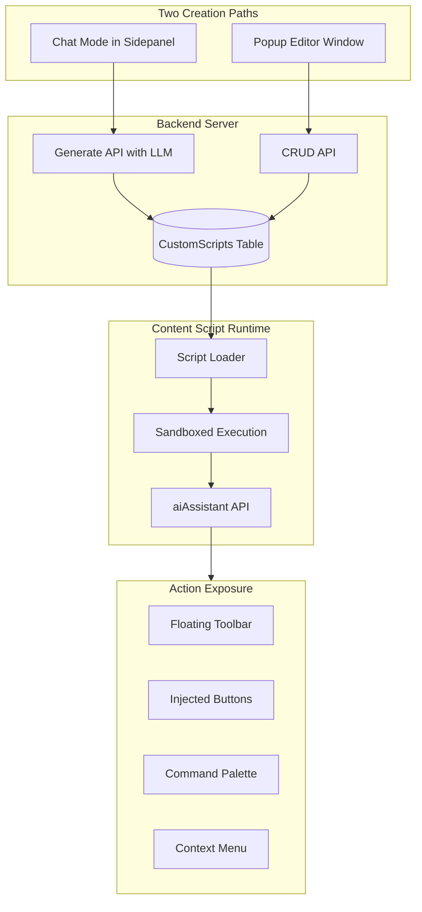
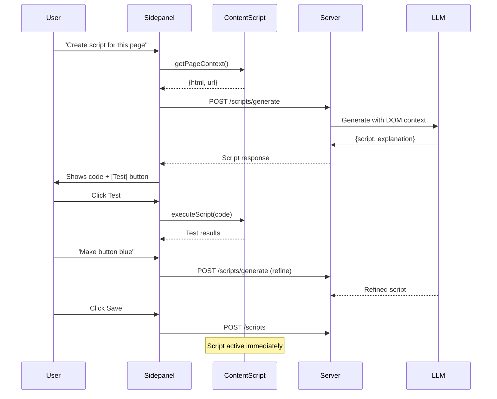
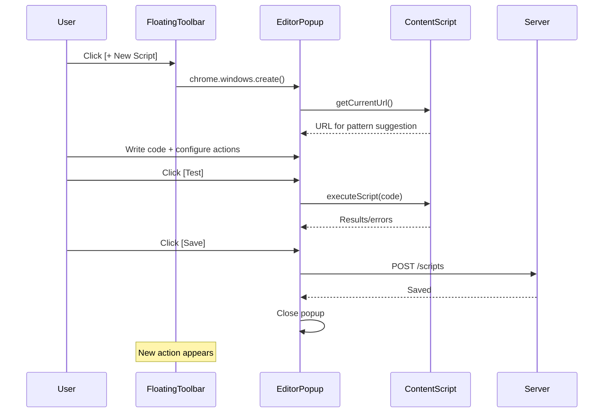

# Custom Scripts System

> **NOTE**: `extension_server.py` referenced in this document has been deprecated. The Chrome extension now uses `server.py` (port 5000). See `documentation/features/extension/` for current architecture.

- Complete Implementation Plan

## 1. Goals and Objectives

**Primary Goal:** Enable users to create custom scripts (like Tampermonkey) that augment their web browsing experience, with AI assistance for script creation and iteration.**Key Capabilities:**

- **Parsing Scripts:** Extract structured content from pages for chat context
- **Functional Scripts:** Multiple actions per website (e.g., copy problem, copy solution on LeetCode)
- **Per-page behavior:** Same script can show different actions on different URLs
- **AI-assisted creation:** LLM sees page structure and helps build scripts through conversation
- **Direct editing:** Popup editor for users who want manual control

---

## 2. Architecture Overview



---

## 3. Data Model

### 3.1 CustomScripts Table (Expanded)

Modify [`extension.py`](extension.py) - expand existing `CustomScripts` table:

```python
CREATE TABLE CustomScripts (
    script_id TEXT PRIMARY KEY,
    user_email TEXT NOT NULL,
    name TEXT NOT NULL,
    description TEXT,
    script_type TEXT DEFAULT 'functional',  -- 'parsing' | 'functional'
    
    -- URL Matching
    match_patterns TEXT NOT NULL,           -- JSON array of URL patterns
    match_type TEXT DEFAULT 'glob',         -- 'glob' | 'regex'
    
    -- Script Code
    code TEXT NOT NULL,                     -- JavaScript code
    
    -- Actions (JSON array for functional scripts)
    actions TEXT,
    
    -- Metadata
    enabled INTEGER DEFAULT 1,
    version INTEGER DEFAULT 1,
    conversation_id TEXT,                   -- Links to creation chat (for editing)
    created_with_llm INTEGER DEFAULT 1,
    
    created_at TEXT,
    updated_at TEXT,
    
    FOREIGN KEY (user_email) REFERENCES users(email)
)
```


### 3.2 Action Schema (JSON in `actions` field)

```json
{
  "id": "copy-problem",
  "name": "Copy Problem",
  "description": "Copy problem details to clipboard",
  "icon": "clipboard",
  "exposure": "floating",
  "inject_selector": null,
  "inject_position": null,
  "page_pattern": "*://leetcode.com/problems/*",
  "handler": "copyProblem",
  "keyboard_shortcut": null
}
```

**Exposure Types:**

- `"floating"` - Appears in floating toolbar
- `"inject"` - Button injected at DOM location (requires `inject_selector`, `inject_position`)
- `"context_menu"` - Right-click context menu item
- `"command"` - Only in command palette (Ctrl+Shift+K)

---

## 4. Backend API

Add to [`extension_server.py`](extension_server.py):| Endpoint | Method | Description ||----------|--------|-------------|| `/ext/scripts` | GET | List user's scripts (optional `?domain=` filter) || `/ext/scripts` | POST | Create new script || `/ext/scripts/<id>` | GET | Get script details || `/ext/scripts/<id>` | PUT | Update script || `/ext/scripts/<id>` | DELETE | Delete script || `/ext/scripts/for-url` | GET | Get scripts matching a URL (`?url=...`) || `/ext/scripts/generate` | POST | LLM generates script from description + page HTML || `/ext/scripts/validate` | POST | Validate script syntax |

### Generate Endpoint (Chat Mode)

```json
// POST /ext/scripts/generate
// Request
{
  "description": "Script for LeetCode to copy problem details",
  "page_html": "<html>...",
  "page_url": "https://leetcode.com/problems/two-sum/",
  "conversation_id": "conv_123",
  "refinement": "Make the button blue"  // Optional, for iterations
}

// Response
{
  "script": {
    "name": "LeetCode Helper",
    "match_patterns": ["*://leetcode.com/problems/*"],
    "code": "const handlers = { copyProblem() { ... } }; ...",
    "actions": [...]
  },
  "explanation": "I created a script that extracts the problem title...",
  "suggested_actions": ["Copy Problem", "Copy Solution"]
}
```

---

## 5. Content Script Runtime

### 5.1 Script Loader (`script_runner.js`)

New file: `extension/content_scripts/script_runner.js`Responsibilities:

1. On page load, check URL against user's script patterns
2. Fetch matching scripts from backend via service worker
3. Execute scripts in sandboxed context
4. Provide `aiAssistant` API to scripts
5. Register handlers for UI components to call

### 5.2 aiAssistant API

```javascript
window.aiAssistant = {
    // DOM Helpers
    dom: {
        query: (selector) => Element | null,
        queryAll: (selector) => Element[],
        waitFor: (selector, timeout) => Promise<Element>,
        getText: (selector) => string,
        setHtml: (selector, html) => void,
        hide: (selector) => void,
        show: (selector) => void,
    },
    
    // Clipboard
    clipboard: {
        copy: (text) => Promise<void>,
        copyHtml: (html) => Promise<void>,
    },
    
    // LLM (proxied through extension)
    llm: {
        ask: (prompt) => Promise<string>,
        askStreaming: (prompt, onChunk) => Promise<void>,
    },
    
    // UI Helpers
    ui: {
        showToast: (message, type) => void,
        showModal: (title, content) => void,
        closeModal: () => void,
    },
    
    // Per-script Storage
    storage: {
        get: (key) => Promise<any>,
        set: (key, value) => Promise<void>,
    },
};
```

---

## 6. UI Components

### 6.1 Floating Toolbar

Draggable toolbar showing script actions for current page:

```javascript
┌─────────────────────────┐
│ AI Scripts    [×] [⚙]  │
├─────────────────────────┤
│ [📋 Copy Problem]       │
│ [📝 Copy Solution]      │
│ [🤖 Analyze Complexity] │
├─────────────────────────┤
│ [+ Create New Script]   │
└─────────────────────────┘
```


### 6.2 Command Palette

`Ctrl+Shift+K` opens searchable palette:

```javascript
┌────────────────────────────────────────┐
│ 🔍 Search actions...                   │
├────────────────────────────────────────┤
│ 📋 Copy Problem (LeetCode Helper)      │
│ 📝 Copy Solution (LeetCode Helper)     │
│ ──────────────────────────────────     │
│ ⚙ Edit Scripts...                      │
│ + Create New Script...                 │
└────────────────────────────────────────┘
```


### 6.3 Script Editor Popup

Popup window for direct script editing:

```javascript
┌─────────────────────────────────────────────────────────────────────────┐
│  Script Editor                                              [×] [Save] │
├─────────────────────────────────────────────────────────────────────────┤
│ Name: [LeetCode Helper                              ]                   │
│ Type: (●) Functional  ( ) Parsing                                       │
│ Match: [*://leetcode.com/problems/*                 ] [+ Add Pattern]  │
├──────────────────────────────────┬──────────────────────────────────────┤
│                                  │  Actions                             │
│  // Your script code             │  ┌────────────────────────────────┐  │
│  const helper = {                │  │ [📋] Copy Problem              │  │
│    copyProblem() {               │  │ Exposure: [Floating ▼]         │  │
│      const title = ...           │  │ Handler: copyProblem           │  │
│    },                            │  │ [Delete]                       │  │
│    copySolution() {              │  └────────────────────────────────┘  │
│      ...                         │  [+ Add Action]                      │
│    }                             │                                      │
│  };                              │                                      │
│                                  │                                      │
│  [Monaco/CodeMirror Editor]      │                                      │
├──────────────────────────────────┴──────────────────────────────────────┤
│  [🤖 Ask AI to Help] [▶ Test on Page]         Status: ✓ Script valid   │
└─────────────────────────────────────────────────────────────────────────┘
```

---

## 7. Creation Flow Diagrams

### 7.1 Chat-Driven Flow




### 7.2 Popup Editor Flow



---

## 8. Example Scripts

### LeetCode Helper (Functional)

```javascript
const leetcodeHelper = {
    copyProblem() {
        const title = aiAssistant.dom.getText('.text-title-large');
        const difficulty = aiAssistant.dom.getText('[class*="difficulty"]');
        const desc = aiAssistant.dom.getText('[data-track-load="description_content"]');
        aiAssistant.clipboard.copy(`# ${title}\n**Difficulty:** ${difficulty}\n\n${desc}`);
        aiAssistant.ui.showToast('Problem copied!', 'success');
    },
    
    copySolution() {
        const code = aiAssistant.dom.getText('.view-lines');
        aiAssistant.clipboard.copy(code);
        aiAssistant.ui.showToast('Solution copied!', 'success');
    },
    
    async analyzeComplexity() {
        const code = aiAssistant.dom.getText('.view-lines');
        const analysis = await aiAssistant.llm.ask(
            `Analyze time/space complexity:\n\n${code}`
        );
        aiAssistant.ui.showModal('Complexity Analysis', analysis);
    }
};
window.__scriptHandlers = leetcodeHelper;
```


### Twitter/X Cleaner (Functional)

```javascript
const twitterCleaner = {
    hideAds() {
        const ads = aiAssistant.dom.queryAll('[data-testid="placementTracking"]');
        ads.forEach(ad => aiAssistant.dom.hide(ad));
        aiAssistant.ui.showToast(`Hidden ${ads.length} ads`, 'success');
    },
    
    dimBotReplies() {
        aiAssistant.dom.queryAll('[data-testid="tweet"]').forEach(tweet => {
            const likes = parseInt(tweet.querySelector('[data-testid="like"]')?.textContent || '0');
            if (likes < 2) tweet.style.opacity = '0.3';
        });
    }
};
window.__scriptHandlers = twitterCleaner;
```


### Custom Parser (Parsing)

```javascript
function parse() {
    return {
        type: 'article',
        title: aiAssistant.dom.getText('h1'),
        author: aiAssistant.dom.getText('.author-name'),
        content: aiAssistant.dom.getText('article'),
        published: aiAssistant.dom.query('time')?.getAttribute('datetime'),
    };
}
window.__parseContent = parse;
```

---

## 9. Security Considerations

| Risk | Mitigation ||------|------------|| Malicious script execution | Scripts run in sandboxed eval with limited API || XSS via injected UI | Sanitize all user-generated content || Credential theft | Scripts cannot access extension storage or auth tokens || Network requests | No direct fetch/XHR; must use `aiAssistant.llm` || Infinite loops | Timeout wrapper around script execution (5s default) || Cross-origin access | Scripts only see same-origin DOM |---

## 10. Files to Create

| File | Purpose ||------|---------|| `extension/content_scripts/script_runner.js` | Script loader + sandboxed execution + aiAssistant API || `extension/content_scripts/script_ui.js` | Floating toolbar + command palette + injected buttons || `extension/content_scripts/script_ui.css` | Styles for all script UI components || `extension/editor/editor.html` | Script editor popup window || `extension/editor/editor.js` | Editor logic (code editor, action builder) || `extension/editor/editor.css` | Editor popup styles |

## 11. Files to Modify

| File | Changes ||------|---------|| [`extension.py`](extension.py) | Expand CustomScripts schema + CRUD methods || [`extension_server.py`](extension_server.py) | Add `/ext/scripts/*` endpoints || `extension/manifest.json` | Register editor popup, new content scripts, permissions || `extension/background/service-worker.js` | Handle script messages, LLM proxy || `extension/sidepanel/sidepanel.js` | Script creation chat flow || `extension/sidepanel/sidepanel.html` | Test/Save buttons for script creation |---

## 12. Implementation Tasks (Granular)

Tasks are ordered so each completes a working increment. After each task, the extension remains functional.

### Phase A: Backend Foundation

**A1: Expand CustomScripts Schema**

- Add new columns to `CustomScripts` in `extension.py`
- Add migration logic or DROP/CREATE table
- Test that existing extension still works

**A2: Add Script CRUD Methods to extension.py**

- `create_custom_script(user_email, script_data)`
- `get_custom_scripts(user_email, domain=None)`
- `get_custom_script(user_email, script_id)`
- `update_custom_script(user_email, script_id, script_data)`
- `delete_custom_script(user_email, script_id)`
- `get_scripts_for_url(user_email, url)` (pattern matching)

**A3: Add CRUD API Endpoints**

- `GET /ext/scripts` - list with optional domain filter
- `POST /ext/scripts` - create
- `GET /ext/scripts/<id>` - get one
- `PUT /ext/scripts/<id>` - update
- `DELETE /ext/scripts/<id>` - delete
- `GET /ext/scripts/for-url?url=...` - get matching scripts
- Test with curl/Postman

**A4: Add Script Generate Endpoint**

- `POST /ext/scripts/generate` - LLM generates script
- Build prompt template with page HTML context
- Return script JSON + explanation
- `POST /ext/scripts/validate` - syntax check

### Phase B: Content Script Runtime

**B1: Create script_runner.js Skeleton**

- Create file with basic structure
- Add to manifest.json content_scripts
- Verify extension loads without errors

**B2: Implement Script Loading**

- On page load, request matching scripts from service worker
- Service worker calls `/ext/scripts/for-url`
- Cache scripts in local storage
- Log loaded scripts to console

**B3: Implement aiAssistant.dom API**

- `query`, `queryAll`, `getText`
- `waitFor` with timeout
- `hide`, `show`, `setHtml`
- Test on sample page

**B4: Implement aiAssistant.clipboard API**

- `copy(text)` - use Clipboard API
- `copyHtml(html)` - copy as rich text
- Test with manual script

**B5: Implement aiAssistant.ui API**

- `showToast(message, type)` - inject toast notification
- `showModal(title, content)` - inject modal dialog
- `closeModal()` - close modal
- Add basic CSS for toast/modal

**B6: Implement Sandboxed Script Execution**

- Create sandbox wrapper with timeout
- Execute user script code safely
- Register `window.__scriptHandlers`
- Call handlers from UI components

**B7: Implement aiAssistant.llm API**

- `ask(prompt)` - message to service worker -> backend
- `askStreaming(prompt, onChunk)` - streaming response
- Service worker proxies to existing chat API

**B8: Implement aiAssistant.storage API**

- `get(key)`, `set(key, value)`
- Use chrome.storage.local with script_id prefix
- Test persistence

### Phase C: Floating Toolbar UI

**C1: Create script_ui.js and script_ui.css**

- Create files with basic structure
- Add to manifest.json
- Verify no errors on load

**C2: Implement Floating Toolbar**

- Draggable container with header
- Close button, settings button
- List of action buttons from loaded scripts
- "+ Create New Script" button
- Store position in localStorage

**C3: Connect Toolbar to Script Runner**

- Toolbar buttons call script handlers
- Show/hide based on page URL match
- Update when scripts change

### Phase D: Command Palette

**D1: Implement Command Palette**

- `Ctrl+Shift+K` keyboard shortcut
- Modal with search input
- List all actions for current page
- Filter as user types

**D2: Add System Commands to Palette**

- "Edit Scripts..." - opens management
- "Create New Script..." - opens editor
- Separate section at bottom

### Phase E: Script Editor Popup

**E1: Create Editor Popup HTML Structure**

- `extension/editor/editor.html`
- Basic form: name, type, match patterns
- Placeholder for code editor
- Placeholder for actions list
- Save/Cancel/Test buttons

**E2: Add CodeMirror/Monaco Editor**

- Integrate lightweight code editor (CodeMirror 6 recommended)
- JavaScript syntax highlighting
- Basic validation

**E3: Implement Action Builder UI**

- Add/remove actions
- Configure: name, icon, exposure type, handler
- For inject type: selector, position fields

**E4: Connect Editor to Backend**

- Load existing script for editing
- Save script via API
- Show validation errors

**E5: Implement Test Button**

- Execute current code on active tab
- Show results/errors in editor
- Allow iteration without saving

**E6: Add "Ask AI" Button in Editor**

- Opens chat sidepanel with script context
- Pre-fills prompt with current code
- User can ask LLM to fix/improve

### Phase F: Chat-Driven Creation

**F1: Add Page Context Extraction**

- Content script function `getPageContext()`
- Returns: URL, simplified HTML structure, key selectors
- Limit HTML size for API

**F2: Detect Script Creation Intent in Chat**

- Recognize prompts like "create a script", "make a userscript"
- Set conversation mode to script_creation
- Send page context with messages

**F3: Display Generated Script in Chat**

- Show code block with syntax highlighting
- "Test Script" button
- "Save Script" button
- "Refine" continues conversation

**F4: Connect Test/Save Buttons**

- Test: execute in content script sandbox
- Save: POST to `/ext/scripts`
- Link script to conversation_id for future edits

### Phase G: Injected Buttons

**G1: Implement Inject Button System**

- For actions with `exposure: "inject"`
- Find element by `inject_selector`
- Insert button at `inject_position` (before/after/inside)
- Style to match page aesthetics

**G2: Handle Dynamic Pages**

- MutationObserver for SPA navigation
- Re-inject buttons when DOM changes
- Debounce for performance

### Phase H: Context Menu (Optional)

**H1: Add Context Menu Registration**

- For actions with `exposure: "context_menu"`
- chrome.contextMenus.create on script load
- Remove on script disable/delete