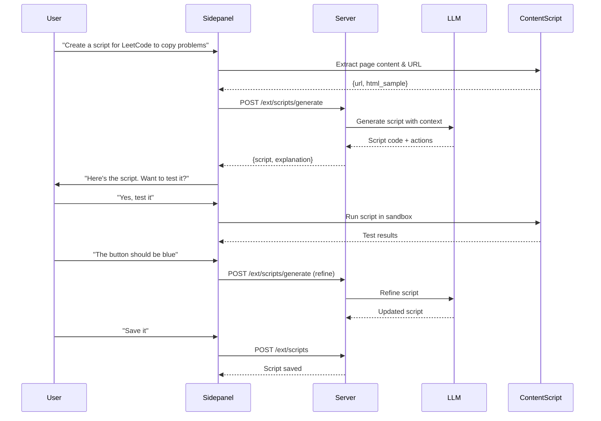

# Custom Scripts System for Extension

## 1. Architecture Overview

```mermaid
flowchart TB
    subgraph chat [Chat-Driven Creation]
        User[User describes script]
        LLM[LLM generates code]
        Preview[Test/Preview]
        Save[Save script]
    end
    
    subgraph storage [Backend Storage]
        DB[(CustomScripts table)]
        API[/ext/scripts/* API]
    end
    
    subgraph execution [Content Script Execution]
        Loader[Script Loader]
        Sandbox[Sandboxed Runtime]
        UIInjector[UI Injector]
    end
    
    subgraph exposure [Action Exposure]
        FloatingBar[Floating Toolbar]
        InjectBtn[Injected Buttons]
        CtxMenu[Context Menu]
        CmdPalette[Command Palette]
    end
    
    User --> LLM --> Preview --> Save --> DB
    DB --> API --> Loader
    Loader --> Sandbox --> UIInjector
    UIInjector --> FloatingBar
    UIInjector --> InjectBtn
    UIInjector --> CtxMenu
    UIInjector --> CmdPalette
```


## 2. Data Model Updates

Expand the `CustomScripts` table in [`extension.py`](extension.py) to support rich script definitions:

```python
# New schema for CustomScripts
CREATE TABLE CustomScripts (
    script_id TEXT PRIMARY KEY,
    user_email TEXT NOT NULL,
    name TEXT NOT NULL,
    description TEXT,
    script_type TEXT DEFAULT 'functional',  # 'parsing' | 'functional'
    
    # Matching
    match_patterns TEXT NOT NULL,           # JSON array of URL patterns
    match_type TEXT DEFAULT 'glob',         # 'glob' | 'regex'
    
    # Script content
    code TEXT NOT NULL,                     # The JavaScript code
    
    # Actions (for functional scripts)
    actions TEXT,                           # JSON array of action definitions
    
    # Metadata
    enabled INTEGER DEFAULT 1,
    version INTEGER DEFAULT 1,
    conversation_id TEXT,                   # Link to conversation that created/edited it
    created_with_llm INTEGER DEFAULT 1,
    
    created_at TEXT,
    updated_at TEXT
)
```

**Action Definition Schema:**

```json
{
  "id": "copy-problem",
  "name": "Copy Problem",
  "description": "Copy problem details to clipboard",
  "icon": "clipboard",
  "exposure": "floating",           // "floating" | "inject" | "context_menu" | "command"
  "inject_selector": ".problem-container",  // For inject exposure
  "inject_position": "before",      // "before" | "after" | "inside"
  "page_pattern": "*://leetcode.com/problems/*",  // Optional sub-pattern
  "handler": "copyProblem"          // Function name in script
}
```


## 3. Backend API Additions

Add to [`extension_server.py`](extension_server.py):| Endpoint | Method | Purpose ||----------|--------|---------|| `GET /ext/scripts` | GET | List user's scripts (with optional domain filter) || `POST /ext/scripts` | POST | Create new script || `GET /ext/scripts/<id>` | GET | Get script details || `PUT /ext/scripts/<id>` | PUT | Update script || `DELETE /ext/scripts/<id>` | DELETE | Delete script || `GET /ext/scripts/for-url` | GET | Get scripts matching a URL || `POST /ext/scripts/generate` | POST | LLM generates script from description || `POST /ext/scripts/test` | POST | Test script with sample HTML |**Key endpoint: `/ext/scripts/generate`**

```json
// Request
{
  "description": "Create a script for LeetCode that copies problem details",
  "target_url": "https://leetcode.com/problems/two-sum/",
  "sample_html": "...",  // Optional, content script can send this
  "conversation_id": "..."
}

// Response
{
  "script": {
    "name": "LeetCode Helper",
    "match_patterns": ["*://leetcode.com/problems/*", "*://leetcode.com/submissions/*"],
    "code": "...",
    "actions": [...]
  },
  "explanation": "This script provides two actions...",
  "preview_available": true
}
```


## 4. Content Script Runtime

Create new file: `extension/content_scripts/script_runner.js`This script will:

1. Check URL against user's script patterns on page load
2. Load matching scripts from storage
3. Execute scripts in a sandboxed context
4. Inject UI elements based on action definitions
5. Provide `aiAssistant` API object for scripts

**Script API exposed to user scripts:**

```javascript
window.aiAssistant = {
    // DOM helpers
    dom: {
        query: (selector) => document.querySelector(selector),
        queryAll: (selector) => [...document.querySelectorAll(selector)],
        waitFor: (selector, timeout) => Promise,
        getText: (selector) => string,
    },
    
    // Clipboard
    clipboard: {
        copy: (text) => Promise,
        copyHtml: (html) => Promise,
    },
    
    // LLM calls
    llm: {
        ask: (prompt) => Promise<string>,
        askStreaming: (prompt, onChunk) => Promise,
    },
    
    // UI helpers
    ui: {
        showToast: (message, type) => void,
        showModal: (title, content) => void,
        closeModal: () => void,
    },
    
    // Storage (per-script)
    storage: {
        get: (key) => Promise,
        set: (key, value) => Promise,
    }
};
```


## 5. UI Components

### 5.1 Floating Toolbar

A draggable toolbar that appears on matching pages, showing available script actions.

```javascript
┌─────────────────────────┐
│ AI Scripts    [×] [≡]  │
├─────────────────────────┤
│ [📋 Copy Problem]       │
│ [📝 Copy Solution]      │
│ [🤖 Analyze Complexity] │
└─────────────────────────┘
```


### 5.2 Injected Buttons

Buttons placed at specific DOM locations defined in action config.

### 5.3 Command Palette

Opened with `Ctrl+Shift+K`, shows all available actions for current page.

```javascript
┌────────────────────────────────────────┐
│ 🔍 Search actions...                   │
├────────────────────────────────────────┤
│ 📋 Copy Problem (LeetCode)             │
│ 📝 Copy Solution (LeetCode)            │
│ 🚫 Hide Ads (Twitter)                  │
│ 🤖 Summarize Thread (Twitter)          │
└────────────────────────────────────────┘
```


## 6. Chat-Driven Script Creation Flow




## 7. Example Scripts

### 7.1 LeetCode Helper (Functional)

```javascript
// Script actions are defined in the actions JSON
// This is the code that runs

const leetcodeHelper = {
    copyProblem() {
        const title = aiAssistant.dom.getText('.text-title-large');
        const difficulty = aiAssistant.dom.getText('[class*="difficulty"]');
        const description = aiAssistant.dom.getText('[data-track-load="description_content"]');
        
        const content = `# ${title}\n**Difficulty:** ${difficulty}\n\n${description}`;
        aiAssistant.clipboard.copy(content);
        aiAssistant.ui.showToast('Problem copied!', 'success');
    },
    
    copySolution() {
        const code = aiAssistant.dom.getText('.view-lines');
        aiAssistant.clipboard.copy(code);
        aiAssistant.ui.showToast('Solution copied!', 'success');
    },
    
    async analyzeComplexity() {
        const code = aiAssistant.dom.getText('.view-lines');
        const analysis = await aiAssistant.llm.ask(
            `Analyze the time and space complexity of this code:\n\n${code}`
        );
        aiAssistant.ui.showModal('Complexity Analysis', analysis);
    }
};

// Export handlers
window.__scriptHandlers = leetcodeHelper;
```


### 7.2 Twitter/X Cleaner (Functional)

```javascript
const twitterCleaner = {
    hideAds() {
        const ads = aiAssistant.dom.queryAll('[data-testid="placementTracking"]');
        ads.forEach(ad => ad.style.display = 'none');
        aiAssistant.ui.showToast(`Hidden ${ads.length} ads`, 'success');
    },
    
    hideBotReplies() {
        const replies = aiAssistant.dom.queryAll('[data-testid="tweet"]');
        let hidden = 0;
        replies.forEach(reply => {
            const metrics = reply.querySelector('[data-testid="like"]');
            const likes = parseInt(metrics?.textContent || '0');
            if (likes < 2) {
                reply.style.opacity = '0.3';
                hidden++;
            }
        });
        aiAssistant.ui.showToast(`Dimmed ${hidden} low-engagement replies`, 'success');
    }
};

window.__scriptHandlers = twitterCleaner;
```


### 7.3 Custom Parser (Parsing)

```javascript
// Parsing script - returns structured data for chat context
function parse() {
    return {
        type: 'article',
        title: aiAssistant.dom.getText('h1'),
        author: aiAssistant.dom.getText('.author-name'),
        content: aiAssistant.dom.getText('article'),
        published: aiAssistant.dom.query('time')?.getAttribute('datetime'),
    };
}

window.__parseContent = parse;
```


## 8. Files to Create/Modify

### New Files:

- `extension/content_scripts/script_runner.js` - Script execution engine
- `extension/content_scripts/script_ui.js` - UI injection (toolbar, buttons, palette)
- `extension/content_scripts/script_ui.css` - Styles for script UI
- `extension/shared/script_api.js` - Script management API client

### Modified Files:

- [`extension.py`](extension.py) - Expand CustomScripts schema + CRUD methods
- [`extension_server.py`](extension_server.py) - Add script API endpoints
- `extension/manifest.json` - Register new content scripts
- `extension/background/service-worker.js` - Handle script-related messages
- `extension/sidepanel/sidepanel.js` - Add script creation chat flow
- `extension/sidepanel/sidepanel.html` - Add script UI elements

## 9. Security Considerations

| Risk | Mitigation ||------|------------|| Malicious script execution | Scripts run in sandboxed eval with limited API || XSS via injected UI | Sanitize all user-generated content || Credential theft | Scripts cannot access extension storage or auth tokens || Network requests | No direct network access; must use `aiAssistant.llm` API || Infinite loops | Timeout wrapper around script execution |

## 10. Implementation Phases

### Phase A: Core Infrastructure (Week 1)

1. Expand database schema
2. Add backend CRUD API endpoints
3. Create script_runner.js skeleton

### Phase B: Execution Engine (Week 2)

4. Implement sandboxed script execution
5. Build `aiAssistant` API object
6. Add script loading on page match

### Phase C: UI Components (Week 3)

7. Floating toolbar component
8. Command palette component
9. Injected button system