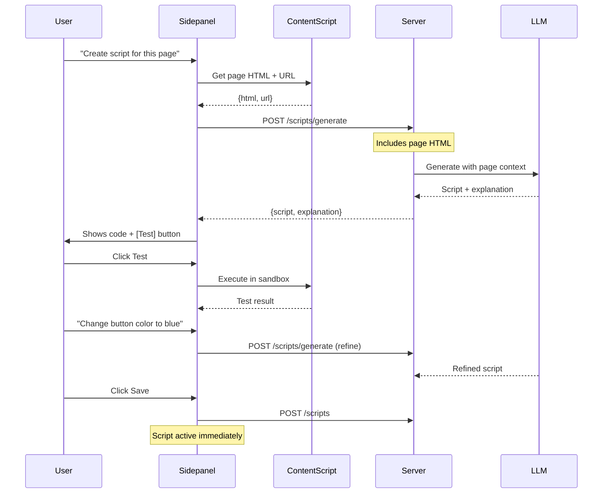
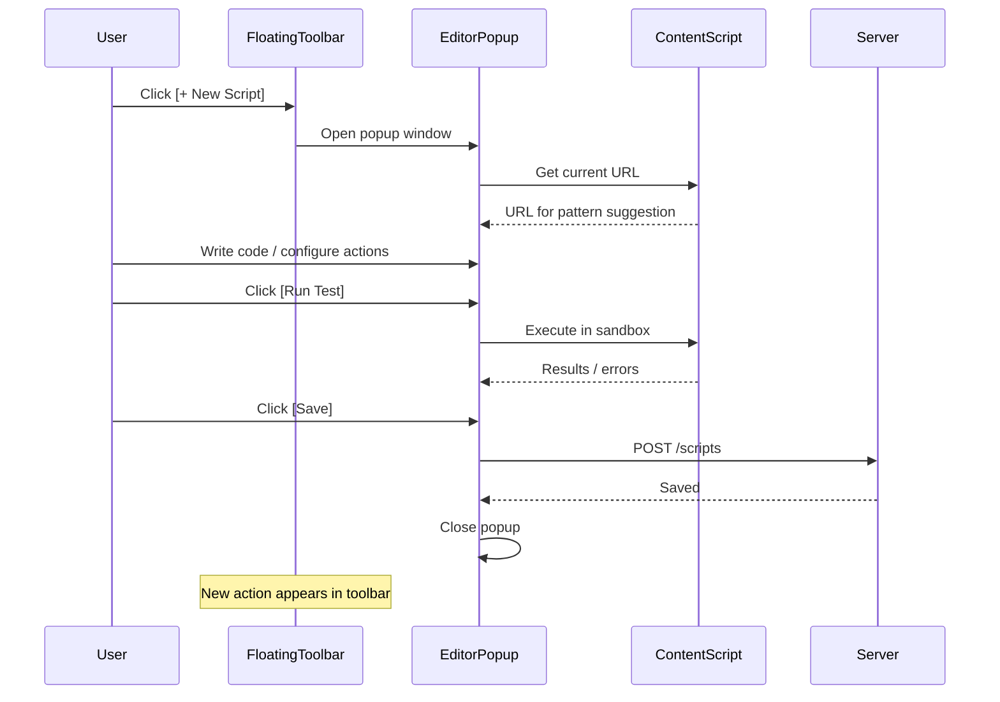

# Custom Scripts System for Extension

> **NOTE**: `extension_server.py` referenced in this document has been deprecated. The Chrome extension now uses `server.py` (port 5000). See `documentation/features/extension/` for current architecture.

## 1. Two Script Creation Modes

### Mode 1: Chat-Driven Creation (Sidepanel)

User converses with LLM in the chat. The LLM sees the current page structure (HTML/DOM) and helps build the script iteratively through conversation.

```javascript
User: "I want a script for LeetCode that copies problem details"
LLM: [Sees page HTML] "I can see the problem page. I'll create a script 
     that extracts the title from .text-title-large, difficulty badge, 
     and description. Should I also add a button to copy the solution code?"
User: "Yes, and make the button blue"
LLM: "Done! Here's the script with two actions. Want to test it?"
[Test button appears in chat]
User: "Works great, save it"
[Script saved and activated]
```


### Mode 2: Direct Popup Editor

A dedicated script editor popup/modal that opens when user wants more control. Features:

- Code editor with syntax highlighting
- Live preview panel showing the page with injected UI
- Action builder (add/remove actions, configure exposure)
- URL pattern tester
- Direct save without chat
```javascript
┌─────────────────────────────────────────────────────────────────────────┐
│  Script Editor                                              [×] [Save] │
├─────────────────────────────────────────────────────────────────────────┤
│ Name: [LeetCode Helper                              ]                   │
│ Match: [*://leetcode.com/problems/*                 ] [+ Add Pattern]  │
├──────────────────────────────────┬──────────────────────────────────────┤
│                                  │  Actions                             │
│  // Your script code             │  ┌────────────────────────────────┐  │
│  const helper = {                │  │ [📋] Copy Problem              │  │
│    copyProblem() {               │  │ Exposure: [Floating ▼]         │  │
│      const title = ...           │  │ Icon: [clipboard ▼]            │  │
│    },                            │  │ Handler: copyProblem           │  │
│    copySolution() {              │  │ [Delete]                       │  │
│      ...                         │  └────────────────────────────────┘  │
│    }                             │  ┌────────────────────────────────┐  │
│  };                              │  │ [📝] Copy Solution             │  │
│                                  │  │ Exposure: [Inject ▼]           │  │
│  [Code Editor with highlighting] │  │ Selector: .code-container      │  │
│                                  │  └────────────────────────────────┘  │
│                                  │  [+ Add Action]                      │
├──────────────────────────────────┴──────────────────────────────────────┤
│  Preview: [Run Test] [Reload Page]              Status: ✓ Script valid │
└─────────────────────────────────────────────────────────────────────────┘
```


## 2. Architecture Overview

```mermaid
flowchart TB
    subgraph creation [Script Creation]
        Chat[Chat Mode<br/>Sidepanel + LLM]
        Editor[Editor Mode<br/>Popup Window]
    end
    
    subgraph storage [Backend]
        DB[(CustomScripts)]
        GenAPI[/ext/scripts/generate]
        CRUD[/ext/scripts CRUD]
    end
    
    subgraph execution [Runtime]
        Loader[Script Loader]
        Sandbox[Sandboxed Exec]
        UI[UI Injector]
    end
    
    Chat --> GenAPI --> DB
    Editor --> CRUD --> DB
    DB --> Loader --> Sandbox --> UI
```


## 3. Data Model

Expand `CustomScripts` table in [`extension.py`](extension.py):

```python
CREATE TABLE CustomScripts (
    script_id TEXT PRIMARY KEY,
    user_email TEXT NOT NULL,
    name TEXT NOT NULL,
    description TEXT,
    script_type TEXT DEFAULT 'functional',  # 'parsing' | 'functional'
    
    # URL Matching
    match_patterns TEXT NOT NULL,           # JSON array
    match_type TEXT DEFAULT 'glob',         # 'glob' | 'regex'
    
    # Code
    code TEXT NOT NULL,
    
    # Actions (JSON array)
    actions TEXT,
    
    # Metadata
    enabled INTEGER DEFAULT 1,
    version INTEGER DEFAULT 1,
    conversation_id TEXT,                   # Links to creation chat
    created_with_llm INTEGER DEFAULT 1,
    
    created_at TEXT,
    updated_at TEXT
)
```

**Action Schema:**

```json
{
  "id": "copy-problem",
  "name": "Copy Problem",
  "description": "Copy problem to clipboard",
  "icon": "clipboard",
  "exposure": "floating",
  "inject_selector": null,
  "inject_position": null,
  "page_pattern": null,
  "handler": "copyProblem"
}
```


## 4. Backend API

Add to [`extension_server.py`](extension_server.py):| Endpoint | Method | Purpose |

|----------|--------|---------|

| `GET /ext/scripts` | GET | List scripts (optionally filter by domain) |

| `POST /ext/scripts` | POST | Create/save script |

| `GET /ext/scripts/<id>` | GET | Get script |

| `PUT /ext/scripts/<id>` | PUT | Update script |

| `DELETE /ext/scripts/<id>` | DELETE | Delete script |

| `GET /ext/scripts/for-url?url=...` | GET | Get scripts matching URL |

| `POST /ext/scripts/generate` | POST | LLM generates script from description + page HTML |

| `POST /ext/scripts/validate` | POST | Validate script code |**Generate endpoint (for chat mode):**

```json
// Request
{
  "description": "Script for LeetCode to copy problems",
  "page_html": "<html>...",
  "page_url": "https://leetcode.com/problems/two-sum/",
  "conversation_id": "...",
  "refinement": "Make the button blue"  // Optional, for iterations
}

// Response  
{
  "script": { "name": "...", "code": "...", "actions": [...] },
  "explanation": "I created a script that...",
  "suggested_actions": [...]
}
```


## 5. Content Script Runtime

New file: `extension/content_scripts/script_runner.js`**aiAssistant API for user scripts:**

```javascript
window.aiAssistant = {
    // DOM (read/write)
    dom: {
        query: (sel) => Element,
        queryAll: (sel) => Element[],
        waitFor: (sel, timeout) => Promise<Element>,
        getText: (sel) => string,
        setHtml: (sel, html) => void,
        hide: (sel) => void,
        show: (sel) => void,
    },
    
    // Clipboard
    clipboard: {
        copy: (text) => Promise,
        copyHtml: (html) => Promise,
    },
    
    // LLM (proxied through extension)
    llm: {
        ask: (prompt) => Promise<string>,
        askStreaming: (prompt, onChunk) => Promise,
    },
    
    // UI helpers
    ui: {
        showToast: (msg, type) => void,
        showModal: (title, content) => void,
        closeModal: () => void,
    },
};
```


## 6. UI Components

### 6.1 Chat Mode Integration (Sidepanel)

Add to sidepanel:

- Detect when user is asking to create/edit scripts
- Send page HTML to LLM for context
- Show "Test Script" button after LLM generates code
- Show "Save Script" button when user confirms
- Link saved script to conversation for future editing

### 6.2 Script Editor Popup

New file: `extension/editor/editor.html` (popup window)Features:

- Monaco/CodeMirror code editor with JS highlighting
- Split view: code left, action config right
- URL pattern input with test button
- Action builder UI (add/remove/configure)
- Live preview: runs script on current page in sandbox
- Save/Cancel buttons
- "Ask AI to help" button that opens chat with script context

### 6.3 Floating Toolbar

Draggable toolbar showing actions for current page:

```javascript
┌─────────────────────────┐
│ AI Scripts    [×] [⚙]  │
├─────────────────────────┤
│ [📋 Copy Problem]       │
│ [📝 Copy Solution]      │
│ [🤖 Analyze]            │
├─────────────────────────┤
│ [+ Create New Script]   │  <- Opens editor popup
└─────────────────────────┘
```


### 6.4 Command Palette

`Ctrl+Shift+K` opens command palette:

```javascript
┌────────────────────────────────────────┐
│ 🔍 Search actions...                   │
├────────────────────────────────────────┤
│ 📋 Copy Problem (LeetCode Helper)      │
│ 📝 Copy Solution (LeetCode Helper)     │
│ ──────────────────────────────────     │
│ ⚙ Edit Scripts...                      │
│ + Create New Script...                 │
└────────────────────────────────────────┘
```


## 7. Creation Flow Diagrams

### Chat-Driven Flow




### Editor Popup Flow




## 8. Example Scripts

### LeetCode Helper

```javascript
const leetcode = {
    copyProblem() {
        const title = aiAssistant.dom.getText('.text-title-large');
        const desc = aiAssistant.dom.getText('[data-track-load="description_content"]');
        aiAssistant.clipboard.copy(`# ${title}\n\n${desc}`);
        aiAssistant.ui.showToast('Copied!');
    },
    
    async analyzeComplexity() {
        const code = aiAssistant.dom.getText('.view-lines');
        const analysis = await aiAssistant.llm.ask(
            `Analyze time/space complexity:\n${code}`
        );
        aiAssistant.ui.showModal('Analysis', analysis);
    }
};
window.__handlers = leetcode;
```


### Twitter Cleaner

```javascript
const twitter = {
    hideAds() {
        aiAssistant.dom.queryAll('[data-testid="placementTracking"]')
            .forEach(el => aiAssistant.dom.hide(el));
        aiAssistant.ui.showToast('Ads hidden');
    },
    
    dimBotReplies() {
        aiAssistant.dom.queryAll('[data-testid="tweet"]').forEach(tweet => {
            const likes = parseInt(tweet.querySelector('[data-testid="like"]')?.textContent || '0');
            if (likes < 2) tweet.style.opacity = '0.3';
        });
    }
};
window.__handlers = twitter;
```


## 9. Files to Create

| File | Purpose |

|------|---------|

| `extension/content_scripts/script_runner.js` | Script execution engine + aiAssistant API |

| `extension/content_scripts/script_ui.js` | Floating toolbar + command palette |

| `extension/content_scripts/script_ui.css` | Styles for script UI |

| `extension/editor/editor.html` | Script editor popup |

| `extension/editor/editor.js` | Editor logic |

| `extension/editor/editor.css` | Editor styles |

## 10. Files to Modify

| File | Changes |

|------|---------|

| [`extension.py`](extension.py) | Expand CustomScripts schema |

| [`extension_server.py`](extension_server.py) | Add /ext/scripts/* endpoints |

| `extension/manifest.json` | Register editor popup, new scripts |

| `extension/sidepanel/sidepanel.js` | Script creation chat flow |

| `extension/background/service-worker.js` | Handle script messages |

## 11. Implementation Phases

### Phase A: Backend + Storage (Days 1-2)

- Expand database schema
- CRUD API endpoints
- LLM generation endpoint

### Phase B: Runtime Engine (Days 3-4)

- script_runner.js with sandbox
- aiAssistant API implementation
- Script loading on URL match

### Phase C: Editor Popup (Days 5-6)

- Editor HTML/JS/CSS
- Code editor integration
- Action builder UI
- Live preview

### Phase D: Chat Integration (Days 7-8)

- Page HTML extraction for LLM
- Script generation in chat flow
- Test button in chat
- Save from chat

### Phase E: UI Polish (Days 9-10)

- Floating toolbar
- Command palette
- Injected buttons