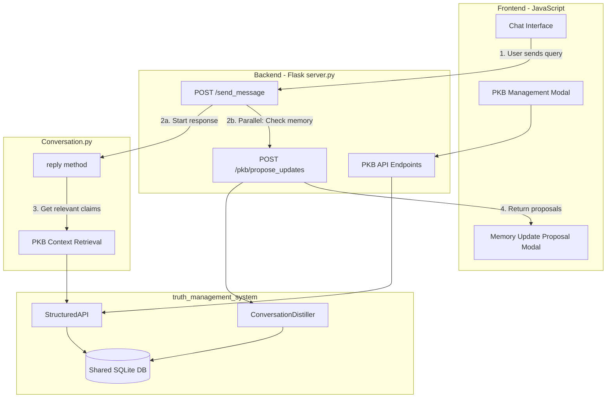

# PKB Integration into Chat System

## Goals

1. Replace `user-details-modal` and `user-preferences-modal` with a unified PKB management modal
2. Use PKB for retrieving relevant user context during chat (in `Conversation.py`)
3. Trigger memory update proposals after user sends a query (before response starts)
4. Show proposed memory changes in a modal for user approval

---

## Architecture Overview



---

## Phase 1: Database Schema Extension

### File: `truth_management_system/models.py`

Add `user_email` column to support multi-user operation:

- Add `user_email: str` field to `Claim`, `Note`, `Entity`, `Tag` dataclasses
- Update `CLAIM_COLUMNS`, `NOTE_COLUMNS`, etc. to include `user_email`

### File: `truth_management_system/database.py`

- Modify `initialize_schema()` to add `user_email` column to all tables
- Add index on `user_email` for efficient filtering

### File: `truth_management_system/crud/*.py`

- Update all CRUD methods to accept `user_email` parameter
- Filter all queries by `user_email`

---

## Phase 2: Backend API Endpoints

### File: `server.py` - New PKB Endpoints

Add these endpoints (all require `@login_required`):

```python
# PKB Instance Management (singleton per app)
pkb_instance = None  # Initialized on startup

def get_user_pkb_api(email: str) -> StructuredAPI:
    """Get PKB API instance scoped to user."""
    # Returns API that auto-filters by user_email

# === CLAIMS CRUD ===
@app.route('/pkb/claims', methods=['GET'])
def pkb_list_claims():
    """List claims with optional filters (claim_type, context_domain, status)"""

@app.route('/pkb/claims', methods=['POST'])
def pkb_add_claim():
    """Add new claim: {statement, claim_type, context_domain, tags?, auto_extract?}"""

@app.route('/pkb/claims/<claim_id>', methods=['PUT'])
def pkb_edit_claim(claim_id):
    """Edit claim: {statement?, claim_type?, confidence?, status?}"""

@app.route('/pkb/claims/<claim_id>', methods=['DELETE'])
def pkb_delete_claim(claim_id):
    """Soft-delete (retract) claim"""

# === SEARCH ===
@app.route('/pkb/search', methods=['POST'])
def pkb_search():
    """Search claims: {query, strategy?, k?, filters?}"""

# === MEMORY UPDATE PROPOSALS ===
@app.route('/pkb/propose_updates', methods=['POST'])
def pkb_propose_updates():
    """Extract memory updates from conversation turn
    Request: {conversation_summary, user_message, assistant_message?}
    Response: {has_updates, proposed_actions[], user_prompt}"""

@app.route('/pkb/execute_updates', methods=['POST'])
def pkb_execute_updates():
    """Execute approved memory updates
    Request: {plan_id, approved_indices[]}
    Response: {executed_count, results[]}"""

# === ENTITIES & TAGS ===
@app.route('/pkb/entities', methods=['GET'])
def pkb_list_entities():
    """List all entities for user"""

@app.route('/pkb/tags', methods=['GET'])
def pkb_list_tags():
    """List all tags with hierarchy"""

# === CONFLICTS ===
@app.route('/pkb/conflicts', methods=['GET'])
def pkb_list_conflicts():
    """List open conflict sets"""

@app.route('/pkb/conflicts/<conflict_id>/resolve', methods=['POST'])
def pkb_resolve_conflict(conflict_id):
    """Resolve conflict: {resolution_notes, winning_claim_id?}"""

# === CONTEXT RETRIEVAL (for Conversation.py) ===
@app.route('/pkb/relevant_context', methods=['POST'])
def pkb_get_relevant_context():
    """Get relevant claims for query context
    Request: {query, conversation_summary?, k?}
    Response: {claims[], formatted_context}"""
```


### Modify Existing Endpoints

Remove or deprecate:

- `/get_user_detail` - Replace with `/pkb/search?filter=fact,memory`
- `/get_user_preference` - Replace with `/pkb/search?filter=preference`
- `/modify_user_detail` - Replace with `/pkb/claims` POST
- `/modify_user_preference` - Replace with `/pkb/claims` POST

Update `/send_message/<conversation_id>`:

- Replace `user_details = getUserFromUserDetailsTable(email)` with PKB retrieval
- Fire async call to `/pkb/propose_updates` after query received

---

## Phase 3: Conversation.py Integration

### File: `Conversation.py`

Replace current user memory/preferences extraction (lines 2122-2123, 2463-2497, 2909-2914) with PKB retrieval:

```python
def reply(self, query, userData=None):
    # ... existing setup ...
    
    # NEW: Get relevant context from PKB instead of raw user_memory/user_preferences
    user_email = userData.get("user_email") if userData else None
    if user_email:
        pkb_context_future = get_async_future(
            self._get_pkb_context,
            user_email,
            query["messageText"],
            summary  # conversation summary
        )
    
    # ... later in the method ...
    
    if user_email and pkb_context_future:
        pkb_context = pkb_context_future.result()
        user_info_text = f"\nRelevant user context from memory:\n{pkb_context}\n\n"
    else:
        user_info_text = ""

def _get_pkb_context(self, user_email: str, query: str, conversation_summary: str) -> str:
    """Retrieve relevant PKB claims for current query."""
    from truth_management_system import create_pkb, StructuredAPI
    # Use shared PKB database with user_email filtering
    # Search for relevant claims
    # Format as bullet points for prompt injection
```

---

## Phase 4: Frontend - PKB Management Modal

### File: `interface/interface.html`

Replace `user-details-modal` and `user-preferences-modal` with unified PKB modal:

```html
<!-- Personal Knowledge Base Modal -->
<div class="modal fade" id="pkb-modal" tabindex="-1" aria-hidden="true">
  <div class="modal-dialog modal-xl">
    <div class="modal-content">
      <div class="modal-header">
        <h5 class="modal-title">Personal Knowledge Base</h5>
        <button type="button" class="close" data-dismiss="modal">
          <span>&times;</span>
        </button>
      </div>
      <div class="modal-body">
        <!-- Tabs -->
        <ul class="nav nav-tabs" id="pkb-tabs">
          <li class="nav-item">
            <a class="nav-link active" data-toggle="tab" href="#pkb-claims">Claims</a>
          </li>
          <li class="nav-item">
            <a class="nav-link" data-toggle="tab" href="#pkb-entities">Entities</a>
          </li>
          <li class="nav-item">
            <a class="nav-link" data-toggle="tab" href="#pkb-tags">Tags</a>
          </li>
          <li class="nav-item">
            <a class="nav-link" data-toggle="tab" href="#pkb-conflicts">Conflicts</a>
          </li>
        </ul>
        
        <div class="tab-content">
          <!-- Claims Tab -->
          <div class="tab-pane active" id="pkb-claims">
            <!-- Search bar -->
            <div class="input-group mb-3">
              <input type="text" id="pkb-search" class="form-control" placeholder="Search memories...">
              <button class="btn btn-primary" id="pkb-search-btn">Search</button>
            </div>
            <!-- Filters -->
            <div class="row mb-3">
              <div class="col-md-4">
                <select id="pkb-filter-type" class="form-control">
                  <option value="">All Types</option>
                  <option value="fact">Facts</option>
                  <option value="preference">Preferences</option>
                  <option value="decision">Decisions</option>
                  <option value="task">Tasks</option>
                  <option value="reminder">Reminders</option>
                  <option value="habit">Habits</option>
                  <option value="memory">Memories</option>
                  <option value="observation">Observations</option>
                </select>
              </div>
              <div class="col-md-4">
                <select id="pkb-filter-domain" class="form-control">
                  <option value="">All Domains</option>
                  <option value="personal">Personal</option>
                  <option value="health">Health</option>
                  <option value="work">Work</option>
                  <option value="relationships">Relationships</option>
                  <option value="learning">Learning</option>
                  <option value="life_ops">Life Ops</option>
                  <option value="finance">Finance</option>
                </select>
              </div>
              <div class="col-md-4">
                <button class="btn btn-success" id="pkb-add-claim-btn">+ Add Claim</button>
              </div>
            </div>
            <!-- Claims list -->
            <div id="pkb-claims-list"></div>
          </div>
          
          <!-- Entities Tab -->
          <div class="tab-pane" id="pkb-entities">
            <div id="pkb-entities-list"></div>
          </div>
          
          <!-- Tags Tab -->
          <div class="tab-pane" id="pkb-tags">
            <div id="pkb-tags-tree"></div>
          </div>
          
          <!-- Conflicts Tab -->
          <div class="tab-pane" id="pkb-conflicts">
            <div id="pkb-conflicts-list"></div>
          </div>
        </div>
      </div>
    </div>
  </div>
</div>

<!-- Add/Edit Claim Modal -->
<div class="modal fade" id="pkb-claim-edit-modal">
  <!-- Form for adding/editing claims -->
</div>

<!-- Memory Update Proposal Modal -->
<div class="modal fade" id="memory-proposal-modal" data-backdrop="static">
  <div class="modal-dialog">
    <div class="modal-content">
      <div class="modal-header">
        <h5 class="modal-title">Memory Update Suggestions</h5>
      </div>
      <div class="modal-body">
        <p id="memory-proposal-intro">I noticed some things worth remembering:</p>
        <div id="memory-proposal-list">
          <!-- Checkboxes for each proposed action -->
        </div>
      </div>
      <div class="modal-footer">
        <button class="btn btn-secondary" id="memory-proposal-skip">Skip All</button>
        <button class="btn btn-primary" id="memory-proposal-save">Save Selected</button>
      </div>
    </div>
  </div>
</div>
```


### File: `interface/chat.js`

Update button bindings:

- Change `#settings-user-details-modal-open-button` to open PKB modal
- Change `#settings-user-preferences-modal-open-button` to open PKB modal (or remove one button)

### File: `interface/pkb-manager.js` (NEW)

Create new JS file for PKB management:

```javascript
var PKBManager = {
    // State
    currentPlan: null,
    
    // API calls
    searchClaims: function(query, filters) { ... },
    addClaim: function(claim) { ... },
    editClaim: function(claimId, updates) { ... },
    deleteClaim: function(claimId) { ... },
    
    // UI rendering
    renderClaimsList: function(claims) { ... },
    renderClaimCard: function(claim) { ... },
    renderEntitiesList: function(entities) { ... },
    renderTagsTree: function(tags) { ... },
    renderConflictsList: function(conflicts) { ... },
    
    // Memory proposal handling
    checkMemoryUpdates: function(conversationId, userMessage) {
        // Called after user sends message
        return $.ajax({
            url: '/pkb/propose_updates',
            method: 'POST',
            data: JSON.stringify({
                conversation_summary: getCurrentConversationSummary(),
                user_message: userMessage
            }),
            contentType: 'application/json'
        });
    },
    
    showMemoryProposalModal: function(proposals) {
        // Render proposals as checkboxes
        // Show modal
    },
    
    executeApprovedUpdates: function(planId, approvedIndices) {
        return $.ajax({
            url: '/pkb/execute_updates',
            method: 'POST',
            data: JSON.stringify({plan_id: planId, approved_indices: approvedIndices}),
            contentType: 'application/json'
        });
    }
};
```

---

## Phase 5: Memory Update Flow Integration

### File: `interface/common-chat.js`

Modify `sendMessageCallback()` (around line 2262):

```javascript
ChatManager.sendMessage(ConversationManager.activeConversationId, messageText, options, links, search)
    .then(function (response) {
        // ... existing response handling ...
        
        // NEW: Check for memory updates (parallel to response streaming)
        PKBManager.checkMemoryUpdates(
            ConversationManager.activeConversationId, 
            messageText
        ).then(function(proposals) {
            if (proposals.has_updates && proposals.proposed_actions.length > 0) {
                PKBManager.currentPlan = proposals;
                // Show modal after a brief delay (don't interrupt initial streaming)
                setTimeout(function() {
                    PKBManager.showMemoryProposalModal(proposals);
                }, 2000);  // 2 second delay
            }
        });
        
        renderStreamingResponse(response, ...);
    });
```

---

## Phase 6: Settings Panel Update

### File: `interface/interface.html` (lines 1262-1271)

Replace two buttons with single PKB button:

```html
<div class="col">
    <button class="btn btn-primary btn-sm rounded-pill w-100" id="settings-pkb-modal-open-button">
        <i class="bi bi-brain"></i> Personal Memory
    </button>
</div>
```

---

## Migration Path

1. **Keep old modals temporarily** - Don't delete immediately; deprecate first
2. **Add migration script** - One-time migration of existing `UserDetails.user_memory` and `UserDetails.user_preferences` to PKB claims
3. **Feature flag** - Allow switching between old and new systems during transition

### Migration Script

```python
def migrate_user_details_to_pkb():
    """Migrate existing user_memory and user_preferences to PKB claims."""
    # Read all rows from UserDetails table
    # For each user:
    #   - Parse user_memory text, create claims with claim_type="memory" or "fact"
    #   - Parse user_preferences text, create claims with claim_type="preference"
    #   - Set meta_json.source = "migration"
```

---

## Files to Modify

| File | Changes ||------|---------|| `truth_management_system/models.py` | Add `user_email` field || `truth_management_system/database.py` | Multi-user schema support || `truth_management_system/crud/*.py` | User-scoped queries || `server.py` | New PKB endpoints, modify `/send_message` || `Conversation.py` | Replace user_memory with PKB retrieval || `interface/interface.html` | New PKB modal, remove old modals || `interface/chat.js` | Update button bindings || `interface/pkb-manager.js` | NEW: PKB management JS || `interface/common-chat.js` | Memory proposal trigger |---

## Testing Strategy

1. **Unit tests** for new PKB endpoints
2. **Integration tests** for memory proposal flow
3. **Manual testing** for modal UI interactions
4. **Migration testing** with sample user data

---

## Risks & Mitigations

| Risk | Mitigation ||------|------------|| PKB database grows large | Add periodic cleanup of old/retracted claims || Memory proposals annoying | Add "don't show for this session" option |