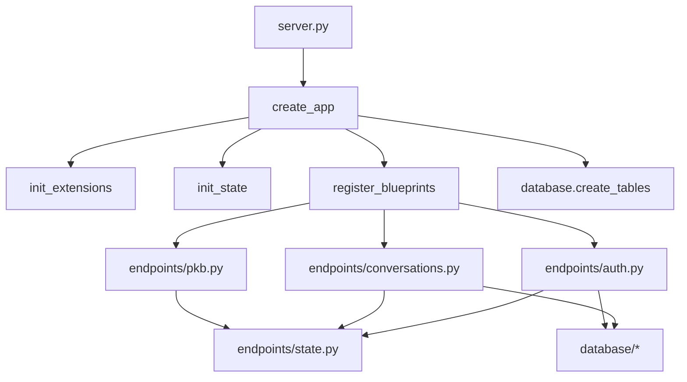

# Modularize `server.py` into `endpoints/` + `database/` (Blueprint + create_app)

## Requirements (what we are achieving)

- Keep **root** [`server.py`](/Users/ahemf/Documents/Backup_2025/Research/chatgpt-iterative/server.py) as the **runtime/debug entrypoint** (per [`.vscode/launch.json`](/Users/ahemf/Documents/Backup_2025/Research/chatgpt-iterative/.vscode/launch.json) which launches `program: "server.py"` and sometimes passes `--login_not_needed`).
- Split all Flask route handlers into an `endpoints/` folder, grouped by domain.
- Move all SQLite/persistence helpers out of `server.py` into `database/`.
- Preserve:
- **All URLs**, **HTTP methods**, and behavioral semantics.
- **Rate limits** and `login_required` behavior.
- CLI flags (`--folder`, `--login_not_needed`) and config resolution.
- Introduce **`create_app()` + Blueprints** so importing modules does not depend on `if __name__ == "__main__"` side-effects.
- Store shared state in a **dedicated module state container** (e.g., `endpoints/state.py`).

Primary refactor reference checklist: [`endpoints_brief_details.md`](/Users/ahemf/Documents/Backup_2025/Research/chatgpt-iterative/endpoints_brief_details.md).

Previous plan: [`.cursor/plans/server.py_modular_refactor_e2513202.plan.md`](/Users/ahemf/Documents/Backup_2025/Research/chatgpt-iterative/.cursor/plans/server.py_modular_refactor_e2513202.plan.md).

## Key design decisions

### 1) App factory + blueprint registration

- Create:
- `create_app(argv: list[str] | None = None) -> OurFlask`
- `main(argv: list[str] | None = None) -> None`
- `server.py` becomes the orchestrator:
- parse args
- resolve folders/paths
- initialize app + extensions (Session, CORS, Cache, Limiter)
- initialize shared state container
- register blueprints
- initialize DB schema
- run the server

### 2) Shared state container (`endpoints/state.py`)

Centralize shared globals that multiple endpoints currently touch (per brief):

- `users_dir`, `pdfs_dir`, `locks_dir`, `cache_dir`, `conversation_folder`
- `conversation_cache`, pinned-claims storage (`_conversation_pinned_claims`)
- cancellation registries/locks (if currently global)
- PKB state + DB path builder

Proposed API surface:

```python
from dataclasses import dataclass

@dataclass
class AppState:
    ...

def init_state(...) -> AppState:
    ...

def get_state() -> AppState:
    ...
```


## File structure (target)

- Root:
- [`server.py`](/Users/ahemf/Documents/Backup_2025/Research/chatgpt-iterative/server.py)
- New:
- `endpoints/` (blueprints + shared state/helpers)
- `database/` (SQLite/persistence layer)

## Data/control-flow (after refactor)




## Risks / challenges + mitigations

- **Import-time side effects** in current `server.py`.
- Mitigation: move to `create_app()` + blueprints; avoid relying on `__main__`.
- **Circular imports**.
- Mitigation: enforce one-way dependencies (endpoints -> state/database; database never imports endpoints).
- **Shared mutable globals** (cache, PKB state, cancellation registries).
- Mitigation: `AppState` + `get_state()`.
- **Decorator dependencies** (`login_required`, `@limiter.limit`, request hooks).
- Mitigation: auth blueprint provides decorator + uses `before_app_request`.

## Milestones (implementation sequence)

1. Scaffolding: create folders, registration, state container, and minimal `create_app()` skeleton.
2. Extract DB functions into `database/` modules with explicit `users_dir` plumbing.
3. Extract shared endpoint utilities into `endpoints/utils.py`.
4. Extract endpoints into domain blueprints.
5. Slim `server.py` to orchestrator only.
6. Route parity + startup verification.

## Optional hardening milestone (post-refactor)